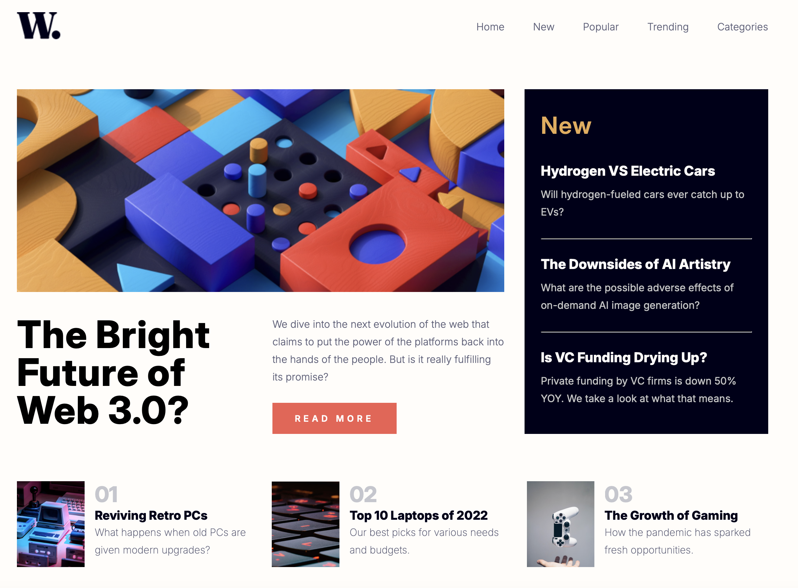

# 🧩​ Responsive Layout Project  

## 📌 Description  
This project showcases a responsive web layout that adapts to various screen sizes using a combination of **CSS Flexbox** and **CSS Grid**. The layout prioritizes usability, aesthetic design, and modern web practices.
---

## ⚒️​ Technologies Used  
- **HTML5** for semantic structure.  
- **CSS3** for responsive styling (Flexbox, Grid, Media Queries).  
- **Figma** for design reference.  
---

## 🎯Features  
- **Responsive Design:** Adapts seamlessly to different devices and screen sizes.  
- **CSS Grid:** Used for the primary structure and layout of the page.  
- **CSS Flexbox:** Used for smaller, flexible components within the layout.  
- **Custom Fonts and Colors:** Enhances the overall visual appeal.  
- **Media Queries:** Adjusts styling based on device dimensions.

---

##📋​ Preview  
Here’s a preview of the responsive layout:  

  

---

## 📝​ Design Reference  
The design for this project was based on the following Figma file:  
[Click here to view the Figma design]([https://www.figma.com/file/your-figma-link-here](https://www.figma.com/design/87gRFe00lSsdbnQx83jufY/FLEX-GRID-RESPONSIVE?node-id=0-1&p=f))  

---

## 📱​ The Final Result  
You can view the deployed version of the project here:  [my website]([https://littlefoxy1nk.github.io/PIXELPERFECT/))  

